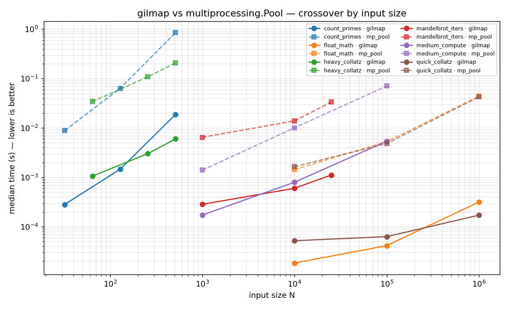
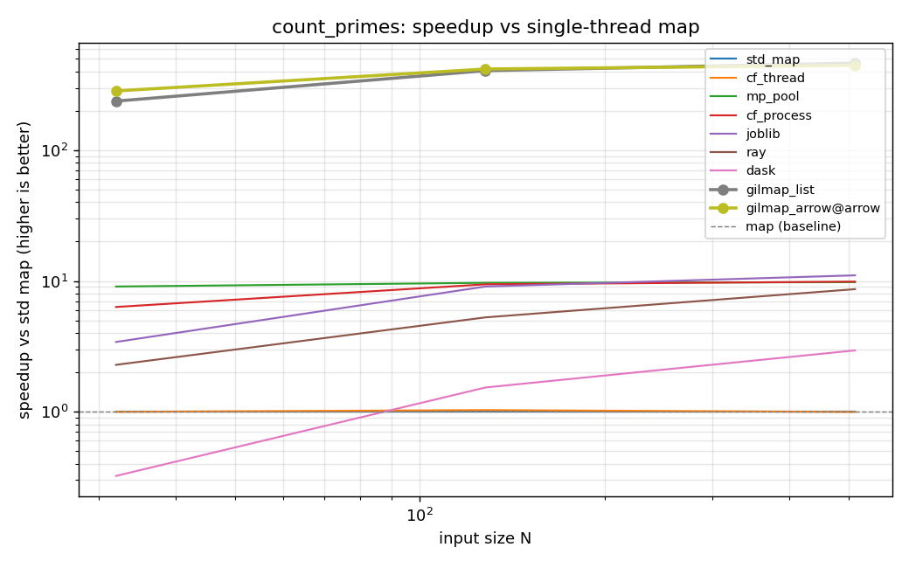
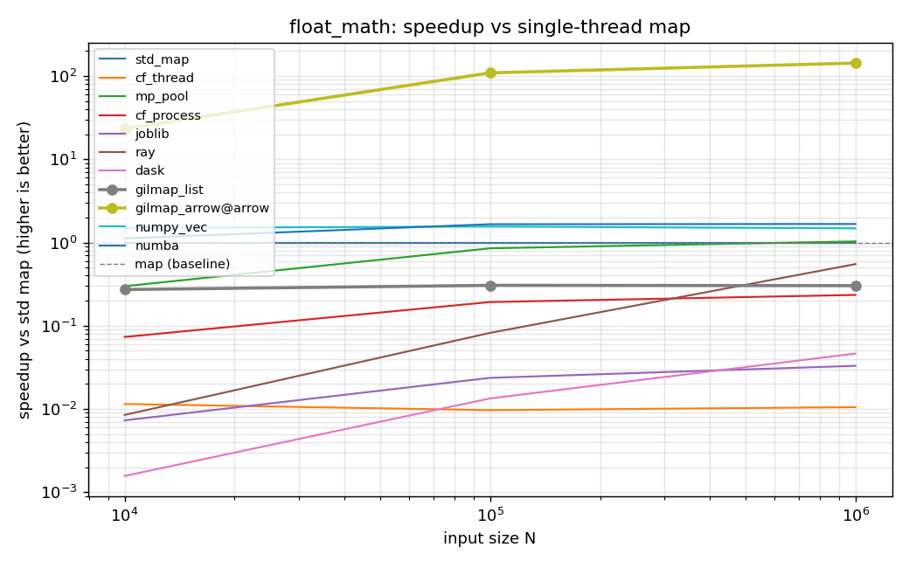
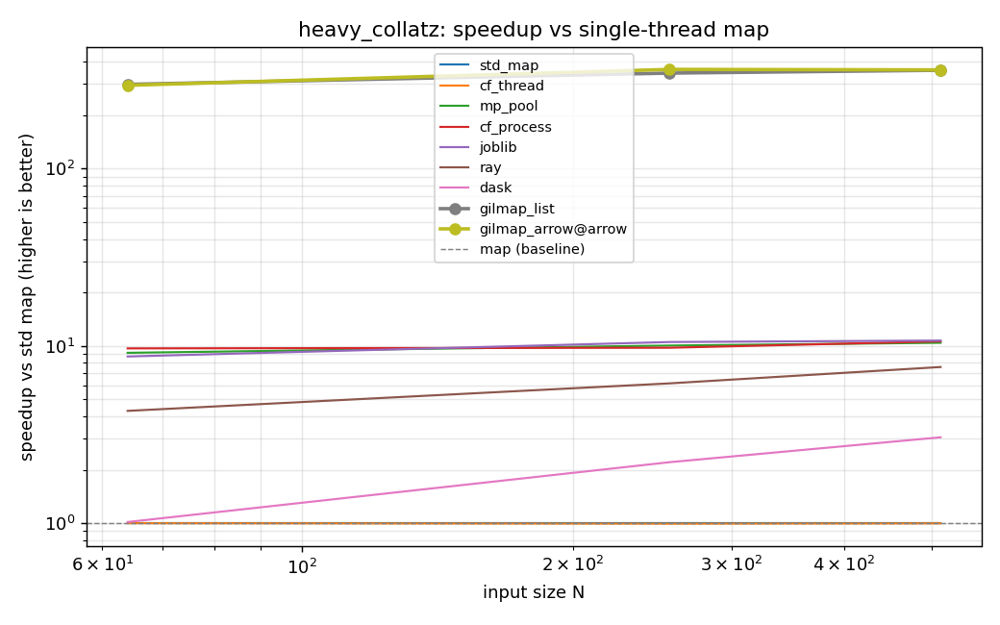
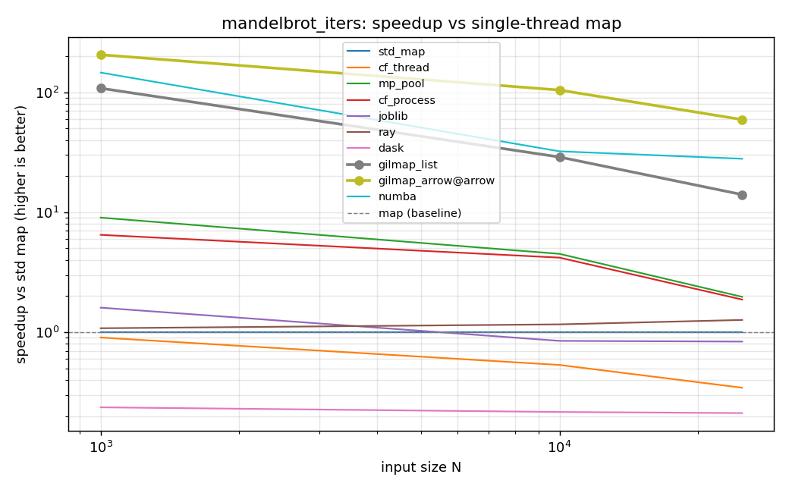
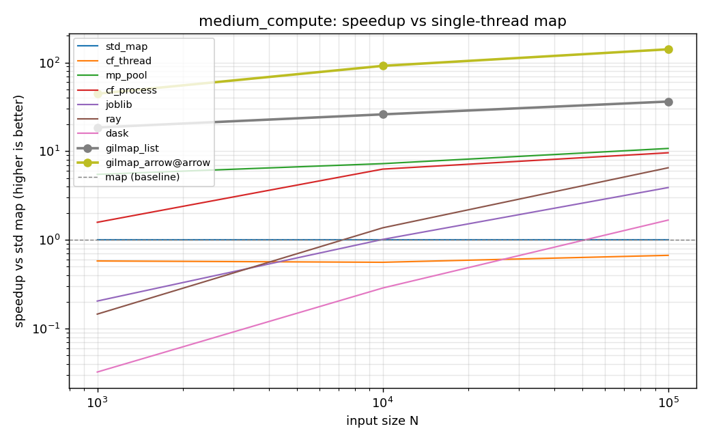
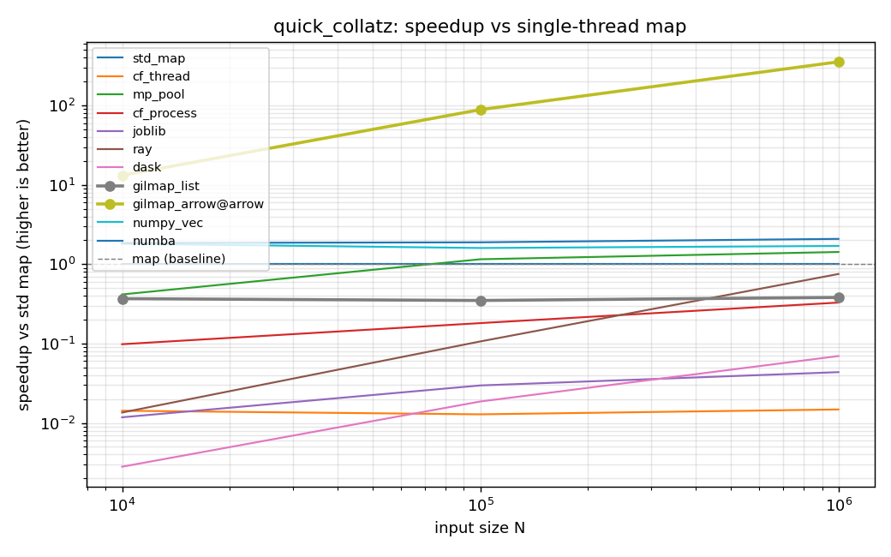

# gilmap benchmark report

This report is generated by `python -m benchmarks.report`. Do not edit by hand.

## Environment
**Hardware:** Apple M3 Max · 14 logical cores · Darwin 25.3.0

**Python:** 3.14.3 (CPython, GIL_disabled=False)

**gilmap commit:** `8b90c19` (dirty)

**Run:** 2026-05-03T08:42:54Z

**Dependency versions:**
- dask: 2026.3.0
- gilmap: unknown
- joblib: 1.5.3
- matplotlib: 3.10.9
- numba: 0.65.1
- numpy: 2.4.4
- psutil: 7.2.2
- pyarrow: 24.0.0
- ray: 2.55.1

## Methodology
- Each cell timed `N` times after one untimed warmup. Warmup covers worker pool init, JIT compilation, and per-process imports — reported separately, not amortized into steady-state numbers.
- Median is the headline; min/max/stdev recorded. Cells with stdev > 10% of median are flagged ⚠ (unstable).
- Every runner's output is byte-equivalent (within 1e-6 float tolerance) to the single-thread `std_map` baseline. Mismatches abort the cell.
- Optional comparators (joblib, numba, ray, dask, numpy_vec) run if installed; otherwise they appear as empty columns.

## gilmap vs multiprocessing — crossover


## Per-workload results
### count_primes

| N | std_map | cf_thread | mp_pool | cf_process | joblib | ray | dask | gilmap_list | gilmap_arrow@arrow | winner |
|---|---|---|---|---|---|---|---|---|---|---|
| 32 | 80.14ms (1.00× vs map) | 80.37ms (1.00× vs map) | 8.84ms (9.07× vs map) | 12.67ms (6.32× vs map) ⚠ | 23.47ms (3.41× vs map) | 35.11ms (2.28× vs map) | 248.48ms (0.32× vs map) | 337µs (237.62× vs map) | **282µs** (284.21× vs map) | **gilmap_arrow@arrow** |
| 128 | 610.89ms (1.00× vs map) | 594.12ms (1.03× vs map) | 63.12ms (9.68× vs map) | 64.79ms (9.43× vs map) | 67.39ms (9.07× vs map) | 116.00ms (5.27× vs map) | 398.90ms (1.53× vs map) | 1.50ms (406.46× vs map) | **1.46ms** (418.22× vs map) | **gilmap_arrow@arrow** |
| 512 | 8.374s (1.00× vs map) | 8.415s (1.00× vs map) | 855.26ms (9.79× vs map) | 847.17ms (9.89× vs map) | 758.40ms (11.04× vs map) | 967.40ms (8.66× vs map) | 2.846s (2.94× vs map) | **18.03ms** (464.53× vs map) | 18.76ms (446.32× vs map) | **gilmap_list** |



### float_math

| N | std_map | cf_thread | mp_pool | cf_process | joblib | ray | dask | gilmap_list | gilmap_arrow@arrow | numpy_vec | numba | winner |
|---|---|---|---|---|---|---|---|---|---|---|---|---|
| 10,000 | 429µs (1.00× vs map) | 37.34ms (0.01× vs map) | 1.44ms (0.30× vs map) | 5.85ms (0.07× vs map) | 58.70ms (0.01× vs map) | 50.53ms (0.01× vs map) | 273.06ms (0.00× vs map) | 1.57ms (0.27× vs map) | **18µs** (23.35× vs map) ⚠ | 286µs (1.50× vs map) | 383µs (1.12× vs map) | **gilmap_arrow@arrow** |
| 100,000 | 4.52ms (1.00× vs map) | 465.94ms (0.01× vs map) | 5.30ms (0.85× vs map) | 23.43ms (0.19× vs map) ⚠ | 190.76ms (0.02× vs map) | 54.97ms (0.08× vs map) | 336.85ms (0.01× vs map) | 14.76ms (0.31× vs map) | **41µs** (109.17× vs map) | 2.90ms (1.56× vs map) | 2.72ms (1.66× vs map) | **gilmap_arrow@arrow** |
| 1,000,000 | 45.16ms (1.00× vs map) | 4.287s (0.01× vs map) | 43.78ms (1.03× vs map) | 192.35ms (0.23× vs map) | 1.367s (0.03× vs map) | 82.02ms (0.55× vs map) | 974.65ms (0.05× vs map) | 148.84ms (0.30× vs map) | **315µs** (143.21× vs map) ⚠ | 30.50ms (1.48× vs map) | 27.03ms (1.67× vs map) | **gilmap_arrow@arrow** |



### heavy_collatz

| N | std_map | cf_thread | mp_pool | cf_process | joblib | ray | dask | gilmap_list | gilmap_arrow@arrow | winner |
|---|---|---|---|---|---|---|---|---|---|---|
| 64 | 310.97ms (1.00× vs map) | 311.32ms (1.00× vs map) | 34.08ms (9.12× vs map) | 32.17ms (9.67× vs map) | 35.74ms (8.70× vs map) | 72.42ms (4.29× vs map) | 306.55ms (1.01× vs map) | **1.04ms** (297.91× vs map) | 1.06ms (294.31× vs map) | **gilmap_list** |
| 256 | 1.092s (1.00× vs map) | 1.100s (0.99× vs map) | 108.85ms (10.03× vs map) | 111.99ms (9.75× vs map) | 103.97ms (10.50× vs map) | 177.87ms (6.14× vs map) | 494.93ms (2.21× vs map) | 3.16ms (344.91× vs map) | **3.02ms** (361.90× vs map) | **gilmap_arrow@arrow** |
| 512 | 2.158s (1.00× vs map) | 2.165s (1.00× vs map) | 207.55ms (10.40× vs map) | 203.82ms (10.59× vs map) | 201.66ms (10.70× vs map) | 284.29ms (7.59× vs map) | 708.12ms (3.05× vs map) | 6.03ms (357.83× vs map) | **6.00ms** (359.61× vs map) | **gilmap_arrow@arrow** |



### mandelbrot_iters

| N | std_map | cf_thread | mp_pool | cf_process | joblib | ray | dask | gilmap_list | gilmap_arrow@arrow | numba | winner |
|---|---|---|---|---|---|---|---|---|---|---|---|
| 1,000 | 58.40ms (1.00× vs map) | 64.61ms (0.90× vs map) | 6.47ms (9.02× vs map) | 9.01ms (6.48× vs map) | 36.41ms (1.60× vs map) | 54.07ms (1.08× vs map) | 246.52ms (0.24× vs map) | 541µs (108.00× vs map) | **284µs** (205.41× vs map) ⚠ | 400µs (145.86× vs map) | **gilmap_arrow@arrow** |
| 10,000 | 62.54ms (1.00× vs map) | 117.07ms (0.53× vs map) | 13.89ms (4.50× vs map) | 14.93ms (4.19× vs map) | 73.75ms (0.85× vs map) | 53.74ms (1.16× vs map) | 288.63ms (0.22× vs map) | 2.17ms (28.85× vs map) | **600µs** (104.28× vs map) | 1.94ms (32.20× vs map) | **gilmap_arrow@arrow** |
| 25,000 | 66.03ms (1.00× vs map) | 191.33ms (0.35× vs map) | 33.46ms (1.97× vs map) | 35.25ms (1.87× vs map) | 78.93ms (0.84× vs map) | 52.14ms (1.27× vs map) | 311.27ms (0.21× vs map) | 4.70ms (14.04× vs map) | **1.12ms** (59.21× vs map) | 2.37ms (27.91× vs map) | **gilmap_arrow@arrow** |



### medium_compute

| N | std_map | cf_thread | mp_pool | cf_process | joblib | ray | dask | gilmap_list | gilmap_arrow@arrow | winner |
|---|---|---|---|---|---|---|---|---|---|---|
| 1,000 | 7.67ms (1.00× vs map) | 13.24ms (0.58× vs map) | 1.40ms (5.49× vs map) | 4.85ms (1.58× vs map) | 37.45ms (0.20× vs map) ⚠ | 52.55ms (0.15× vs map) | 236.35ms (0.03× vs map) | 414µs (18.54× vs map) | **172µs** (44.52× vs map) ⚠ | **gilmap_arrow@arrow** |
| 10,000 | 73.07ms (1.00× vs map) | 130.36ms (0.56× vs map) | 10.08ms (7.25× vs map) | 11.61ms (6.29× vs map) | 72.00ms (1.01× vs map) | 53.30ms (1.37× vs map) | 254.21ms (0.29× vs map) | 2.80ms (26.05× vs map) | **796µs** (91.76× vs map) | **gilmap_arrow@arrow** |
| 100,000 | 759.89ms (1.00× vs map) | 1.133s (0.67× vs map) | 70.66ms (10.75× vs map) | 79.05ms (9.61× vs map) | 194.99ms (3.90× vs map) | 116.67ms (6.51× vs map) | 453.55ms (1.68× vs map) | 20.91ms (36.34× vs map) | **5.39ms** (141.04× vs map) | **gilmap_arrow@arrow** |



### quick_collatz

| N | std_map | cf_thread | mp_pool | cf_process | joblib | ray | dask | gilmap_list | gilmap_arrow@arrow | numpy_vec | numba | winner |
|---|---|---|---|---|---|---|---|---|---|---|---|---|
| 10,000 | 686µs (1.00× vs map) | 48.11ms (0.01× vs map) ⚠ | 1.65ms (0.42× vs map) ⚠ | 6.98ms (0.10× vs map) ⚠ | 58.23ms (0.01× vs map) | 50.71ms (0.01× vs map) | 244.23ms (0.00× vs map) | 1.86ms (0.37× vs map) | **52µs** (13.18× vs map) | 378µs (1.81× vs map) | 371µs (1.85× vs map) | **gilmap_arrow@arrow** |
| 100,000 | 5.58ms (1.00× vs map) | 434.74ms (0.01× vs map) | 4.83ms (1.16× vs map) | 30.81ms (0.18× vs map) ⚠ | 188.04ms (0.03× vs map) | 52.46ms (0.11× vs map) | 299.70ms (0.02× vs map) | 15.98ms (0.35× vs map) | **63µs** (88.65× vs map) ⚠ | 3.49ms (1.60× vs map) | 2.96ms (1.89× vs map) | **gilmap_arrow@arrow** |
| 1,000,000 | 60.78ms (1.00× vs map) | 4.110s (0.01× vs map) | 42.61ms (1.43× vs map) | 184.93ms (0.33× vs map) | 1.392s (0.04× vs map) | 80.70ms (0.75× vs map) | 872.37ms (0.07× vs map) | 159.31ms (0.38× vs map) | **171µs** (355.07× vs map) ⚠ | 35.76ms (1.70× vs map) | 29.14ms (2.09× vs map) | **gilmap_arrow@arrow** |



## Where gilmap loses (honest)
_No losses recorded in this run. Likely cherry-picked workloads — re-run with the full suite._

## When NOT to use gilmap
- **Tiny per-element work.** If each call is < ~1 µs of Python, framework overhead dominates and a plain `map(...)` will beat every parallel approach. See `quick_collatz` results above.
- **Vectorizable numeric kernels.** If your function can be expressed as NumPy ufuncs or JIT-compiled with numba, that's almost always faster than parallelizing a Python-level callable. See `float_math` results.
- **I/O-bound work.** gilmap parallelizes CPU. Use asyncio or thread pools for network/disk.
- **Lambdas / nested functions / `__main__` functions.** Worker sub-interpreters import callables by `(module, name)`. Put your function in an importable module.
- **Free-threaded CPython (cp313t).** PEP 703 builds are explicitly unsupported; gilmap raises at import.
- **Non-numeric data.** Only `int64` and `float64` lanes are supported today.

## Where gilmap shines
These are real cells where gilmap is the fastest runner. Listed best-first.

| workload | N | gilmap variant | gilmap (s) | runner-up | runner-up (s) | speedup |
|---|---|---|---|---|---|---|
| quick_collatz | 1,000,000 | gilmap_arrow@arrow | 171µs | numba | 29.14ms | 170.22× |
| float_math | 1,000,000 | gilmap_arrow@arrow | 315µs | numba | 27.03ms | 85.72× |
| float_math | 100,000 | gilmap_arrow@arrow | 41µs | numba | 2.72ms | 65.80× |
| quick_collatz | 100,000 | gilmap_arrow@arrow | 63µs | numba | 2.96ms | 46.96× |
| count_primes | 128 | gilmap_arrow@arrow | 1.46ms | mp_pool | 63.12ms | 43.21× |
| count_primes | 512 | gilmap_list | 18.03ms | joblib | 758.40ms | 42.07× |
| heavy_collatz | 256 | gilmap_arrow@arrow | 3.02ms | joblib | 103.97ms | 34.47× |
| heavy_collatz | 512 | gilmap_arrow@arrow | 6.00ms | joblib | 201.66ms | 33.61× |
| count_primes | 32 | gilmap_arrow@arrow | 282µs | mp_pool | 8.84ms | 31.35× |
| heavy_collatz | 64 | gilmap_list | 1.04ms | cf_process | 32.17ms | 30.82× |
| float_math | 10,000 | gilmap_arrow@arrow | 18µs | numpy_vec | 286µs | 15.58× |
| medium_compute | 100,000 | gilmap_arrow@arrow | 5.39ms | mp_pool | 70.66ms | 13.12× |
| medium_compute | 10,000 | gilmap_arrow@arrow | 796µs | mp_pool | 10.08ms | 12.65× |
| medium_compute | 1,000 | gilmap_arrow@arrow | 172µs | mp_pool | 1.40ms | 8.11× |
| quick_collatz | 10,000 | gilmap_arrow@arrow | 52µs | numba | 371µs | 7.13× |
| mandelbrot_iters | 10,000 | gilmap_arrow@arrow | 600µs | numba | 1.94ms | 3.24× |
| mandelbrot_iters | 25,000 | gilmap_arrow@arrow | 1.12ms | numba | 2.37ms | 2.12× |
| mandelbrot_iters | 1,000 | gilmap_arrow@arrow | 284µs | numba | 400µs | 1.41× |

## First-call (warmup) cost
Two costs sit outside steady-state numbers and are reported here so they aren't amortized into the speedup figures:

1. **Per-process setup** (paid once when you first import / construct the runner).
2. **Per-cell first call** (paid the first time a given runner is asked to do real work — pool spinup, JIT, worker sub-interpreter import).

### Per-process setup
| runner | one-time process setup |
|---|---|
| ray | 2.249s |
| numba | 100.19ms |
| mp_pool | 35.46ms |
| joblib | 519µs |
| cf_process | 432µs |
| cf_thread | 38µs |
| dask | 6µs |
| gilmap_list | 2µs |
| numpy_vec | 1µs |
| gilmap_arrow | 1µs |
| std_map | 1µs |

### Per-cell first call (warmup)
| runner | warmup (first call) | typical steady-state | overhead |
|---|---|---|---|
| gilmap_list | 3.77ms | 337µs | 3.43ms |
| gilmap_arrow@arrow | 347µs | 282µs | 65µs |
| mp_pool | 35.46ms | 8.84ms | 26.62ms |
| ray | 2.249s | 35.11ms | 2.214s |
| joblib | 203.91ms | 23.47ms | 180.44ms |

## Reproduce
```
pip install -e ".[bench]"
python -m benchmarks.run --out benchmarks/results/local.json
python -m benchmarks.report benchmarks/results/local.json
```